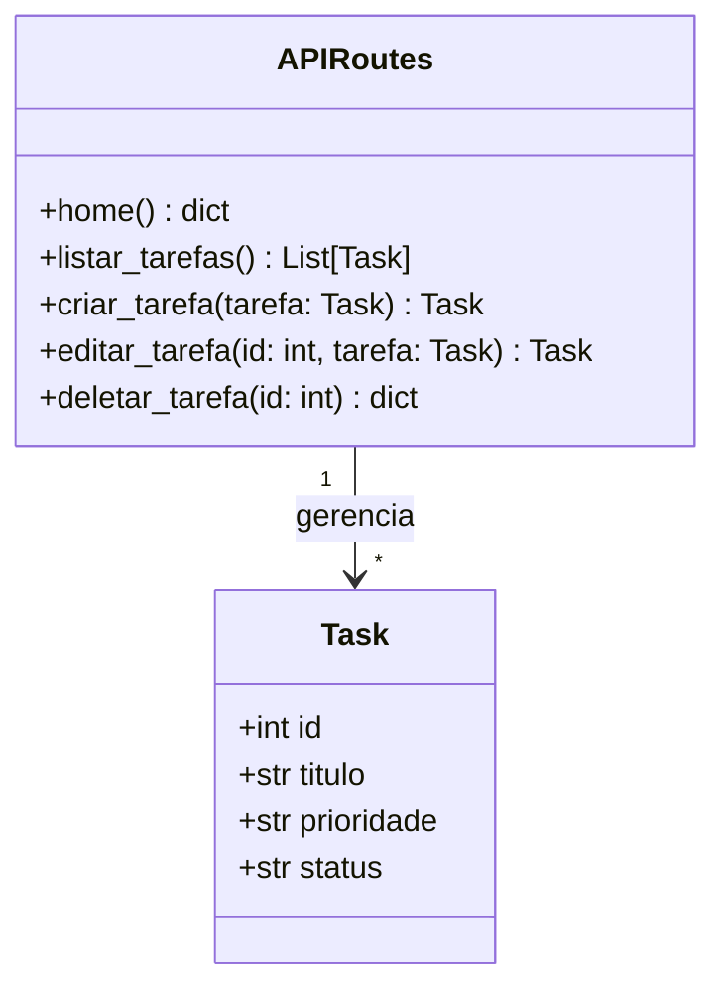

# Documentação de Modelagem e Diagramas UML

Este diretório contém a modelagem do sistema **TaskFlow Agile**, representando a estrutura e o comportamento do sistema de gerenciamento de tarefas desenvolvido.

---

## 1. Diagrama de Casos de Uso (UML)

O diagrama abaixo descreve as interações dos atores (Usuário/Equipe) com o sistema.

```mermaid
leftToRightDirection
actor "Usuário da Equipe" as User

rectangle "Sistema TaskFlow Agile" {
  usecase "Criar Tarefa" as UC_Criar
  usecase "Listar Tarefas" as UC_Listar
  usecase "Editar Tarefa" as UC_Editar
  usecase "Deletar Tarefa" as UC_Deletar
  usecase "Definir Prioridade" as UC_Prioridade
}

User --> UC_Criar
User --> UC_Listar
User --> UC_Editar
User --> UC_Deletar
UC_Criar ..> UC_Prioridade : <<include>>
UC_Editar ..> UC_Prioridade : <<include>>
```

---

## 2. Diagrama de Classes (UML)

O diagrama abaixo representa a estrutura de dados e as classes principais do sistema.


